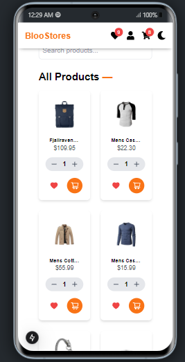
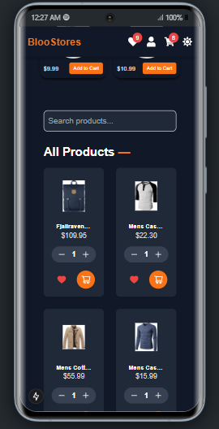
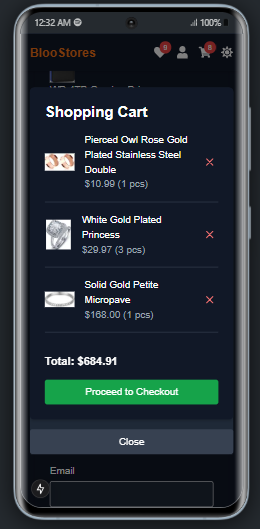

# BlooStore E-Commerce Platform - Front-End Intern Challenge

## Overview

This project is a simplified e-commerce platform built as part of the Front-End Software Engineer Intern practical challenge. It includes a **Product Listing Page**, **Cart Management**, and a **Checkout Page** with shipping details form. The application is built using **React (Next.js)**, **TypeScript**, and **Tailwind CSS**, and integrates with a mock API for product data.

## Features

### 1. **Product Listing Page**
   - Fetches and displays a list of products from the [FakeStore API](https://fakestoreapi.com/products).
   - Each product includes an image, name, price, and an "Add to Cart" button.
   - Responsive grid layout using **Tailwind CSS**.

### 2. **Cart Management**
   - Users can add and remove items from the cart.
   - Dynamic display of the total price of selected items.
   - Global state management using **Zustand**.

### 3. **Checkout Page**
   - Displays selected items and the total amount.
   - Includes a form for entering shipping details (Name, Address, Phone Number, Email).
   - Basic form validation using **TypeScript**.

### 4. **API Integration**
   - Fetches product data from the FakeStore API.
   - Handles loading states and error scenarios gracefully.

### 5. **Bonus Features**
   - **Dark Mode**: Implemented using Tailwind CSS.
   - **Search Bar**: Allows users to filter products dynamically.
   - **Confirmation Modal**: Displays a modal before finalizing the checkout.
   - **Local Storage**: Persists cart data across page reloads.
   - **Deployment**: The project is deployed on **Vercel**.

## Technologies Used

- **React (Next.js)**: Framework for building the application.
- **TypeScript**: Ensures type safety and improves code quality.
- **Tailwind CSS**: Utility-first CSS framework for styling.
- **Zustand**: Lightweight state management library.
- **FakeStore API**: Provides mock product data.
- **Vercel**: Deployment platform for hosting the application.

## Installation

To run this project locally, follow these steps:

1. **Clone the repository**:
   ```bash
   git clone https://github.com/Jclinch/BlooStores.git
   cd bloostores
   ```

2. **Install dependencies**:
   ```bash
     yarn install
   ```

3. **Run the development server**:
   ```bash
     yarn dev
   ```

4. **Open the application**:
   Visit `http://localhost:3000` in your browser.

## Deployment

The application is deployed on **Vercel**. You can access it here:  
[Live Demo](https://bloostores.vercel.app/)


## Evaluation Criteria

- **Code Quality & Structure**: Clean, readable, and well-organized code.
- **Functionality & Completeness**: Implementation of all required features.
- **User Experience (UI/UX)**: Responsive, visually appealing, and intuitive design.
- **Performance & Optimization**: Efficient API handling and state management.
- **Error Handling & Validation**: Graceful handling of edge cases.

## Submission

- **GitHub Repository**: [BlooStores](https://github.com/Jclinch/BlooStores.git)
- **Deployed Link**: [Live Demo](https://bloostores.vercel.app/)
- **Contact Email**: sunnyugwu2011@gmail.com

---

## Screenshots

### Product Listing Page



### Cart Page



### Checkout Page


### Dark Mode


---

## License

This project is licensed by Sunny Ugwu

---

## Acknowledgments

- [FakeStore API](https://fakestoreapi.com) for providing mock product data.
- [Tailwind CSS](https://tailwindcss.com) for the utility-first CSS framework.
- [Zustand](https://zustand-demo.pmnd.rs) for lightweight state management.

---

### Note on Future Enhancements
Due to prior commitments, including preparations and participation at Household of David's annual Mercy Conference '25, I was unable to implement additional features that would further enhance the e-commerce platform. Some of these planned features include:

Product Details Page: A dedicated page to display individual products with comprehensive details such as descriptions, reviews, and related products.

User Authentication: Secure login and registration functionality to enable personalized user experiences.

Order History: A feature allowing users to view their past orders and track their status.

These features are part of the roadmap for future development and would significantly improve the platform's functionality and user experience.

---

Thank you for reviewing my submission! I look forward to your feedback.

---
